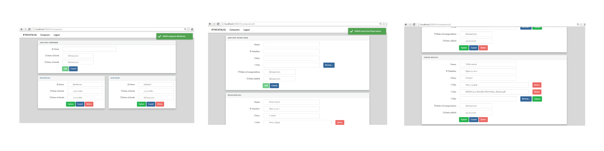

# The Catalog

This web app can be used to store and catalog sheet music files that may have unique annotations, editing or fingering. 
The user can scan each page of edited music, or annotate a pdf file, and upload all files to the server through the web interface. 
The user creates a sheet music item to associated the uploaded files with.
Each sheet music item may have associated data such as an identifying number (opus or another cataloging system number)
and key (such as C major). Sheet music items are cataloged to a composer. All composer, music items, and music
files are unique to a individual signed-on user.

## Technical information

The front end of this web app was built using the [AngularJS](https://angularjs.org/) framework with [bootstrap](http://getbootstrap.com/) css components.
Data is updated and retrieved via a python [Flask](http://flask.pocoo.org/) web server through calls to a REST api.
The front end portion of the authentication service utilizes angular library [Satellizer](https://github.com/sahat/satellizer).


## Environment

You'll need the following for your development environment:

- [Python](http://www.python.org)
- [PostgreSQL](http://www.postgresql.org/)
- [virtualenv](https://python-guide.readthedocs.org/en/latest/dev/virtualenvs/#virtualenv) (recommended)

## Local Installation

The following assumes you have all of the tools listed above installed.

1. Clone the project:

    ```
	$ git clone https://github.com/thurstonemerson/the-catalog.git
	$ cd the-catalog
    ```

1. Create and initialize virtualenv for the project:

    ```
	$ mkvirtualenv the-catalog
	$ pip install -r requirements.txt
    ```

1. This module has a PostgreSQL backend. The database can be created using the script provided:

    ```
	$ sudo su postgres
	$ psql 
	$ \i catalog_create_database.sql
    ```
    
1. Seed the database via this python script:

    ```
	$ python catalog_seed_database.py
    ```
    
    This script generates some test data to play around with. Two users are created with the
email/password combinations katja@gmail.com/cat and louisa@gmail.com/dog.

## Run the program
 	
- The web server can be started with the following command:
    ```
	python run.py
	```
	
- The client can be accessed through http://localhost:5000/
 	

## Usage

1. First log into the app using via the log in screen 

1. Successful login will show a success message 

1. If it is the first time logging into the application, you will need to create some 
composers and music items. 

1. Once you have added some composers, you can use the hyperlink in the composers name
to navigate to a list of music items.

1. Add a music item and file to associate with the composer.

1. Multiple files can be added and uploaded with a music item. Music items and files can be updated or deleted.



## Browser support

This web app has been tested on Firefox 43.0.4 and on Chrome 48.0.2564.97 m. 

### Authentication and authorization

Authentication is provided either via Oauth ([Google](www.google.com), [Facebook](www.facebook.com), [Twitter](www.twitter.com)), or through a user supplied email/password
combination. Note that the web app should be run under https in order to securely save passwords.
Passwords are stored in the database via a one way hashing function for security.

Once logged in, JSON web tokens are used to authenticate users rather than cookies. Therefore we do not need to 
store a randomly generated string in the session to mitigate CSRF attacks.
(See [here](http://stackoverflow.com/questions/21357182/csrf-token-necessary-when-using-stateless-sessionless-authentication) for more information.) 
This web token will expire after one hour. The web tokens are passed as a bearer in the HTTP authorization header. 
It is not possible to access the REST api JSON endpoints via the browser once logged in, as the web token is required
in the HTTP header.

## Known Issues

- Application has not yet been tested running over SSL.
- HTML5 date input is not supported in Firefox. Therefore a placeholder text 'yyyy-mm-dd' has been added to instruct the user how to enter a valid date.


## License

The MIT License (MIT)

Copyright (c) 2016 Thurston Emerson

Permission is hereby granted, free of charge, to any person obtaining a copy of this software and associated documentation files (the "Software"), to deal in the Software without restriction, including without limitation the rights to use, copy, modify, merge, publish, distribute, sublicense, and/or sell copies of the Software, and to permit persons to whom the Software is furnished to do so, subject to the following conditions:

The above copyright notice and this permission notice shall be included in all copies or substantial portions of the Software.

THE SOFTWARE IS PROVIDED "AS IS", WITHOUT WARRANTY OF ANY KIND, EXPRESS OR IMPLIED, INCLUDING BUT NOT LIMITED TO THE WARRANTIES OF MERCHANTABILITY, FITNESS FOR A PARTICULAR PURPOSE AND NONINFRINGEMENT. IN NO EVENT SHALL THE AUTHORS OR COPYRIGHT HOLDERS BE LIABLE FOR ANY CLAIM, DAMAGES OR OTHER LIABILITY, WHETHER IN AN ACTION OF CONTRACT, TORT OR OTHERWISE, ARISING FROM, OUT OF OR IN CONNECTION WITH THE SOFTWARE OR THE USE OR OTHER DEALINGS IN THE SOFTWARE.

