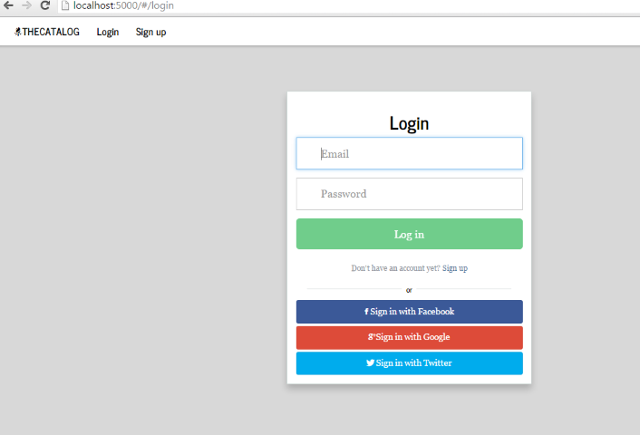
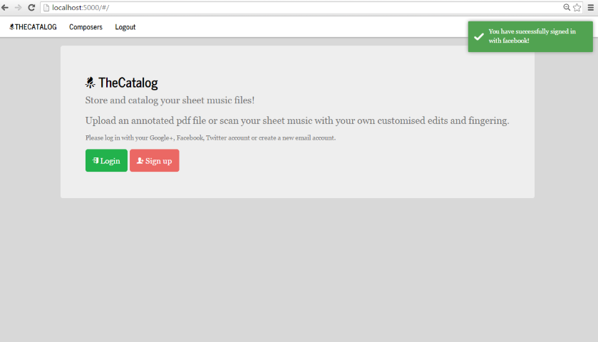
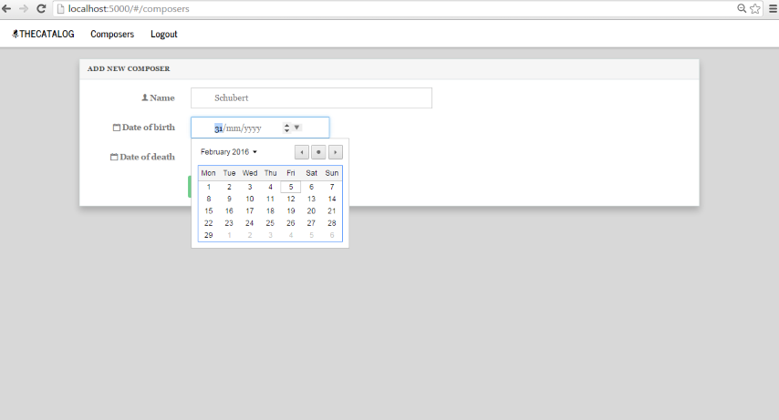
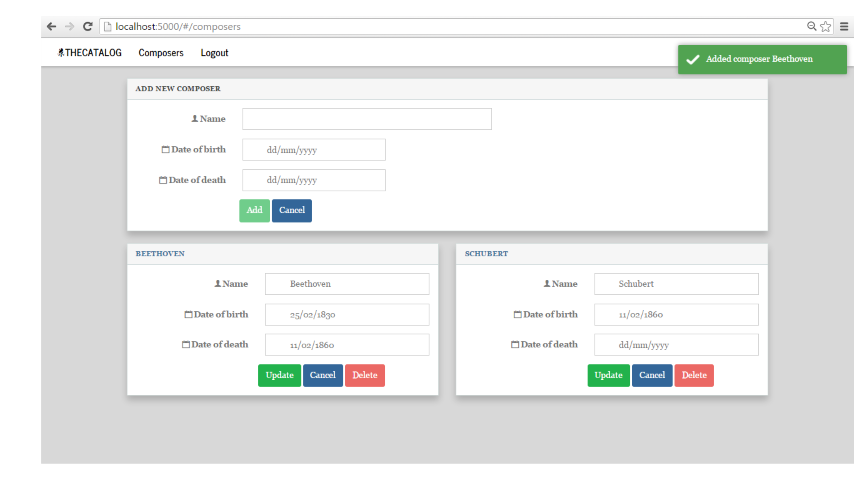
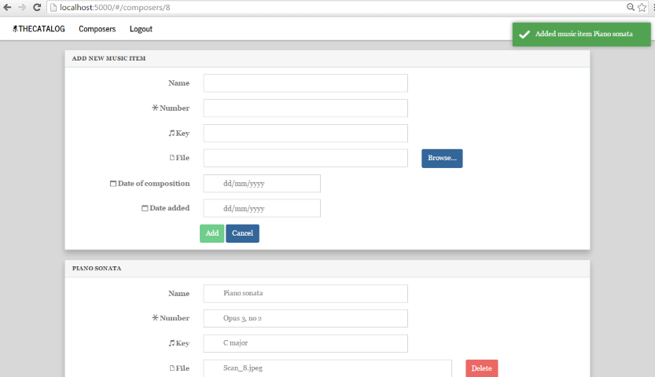
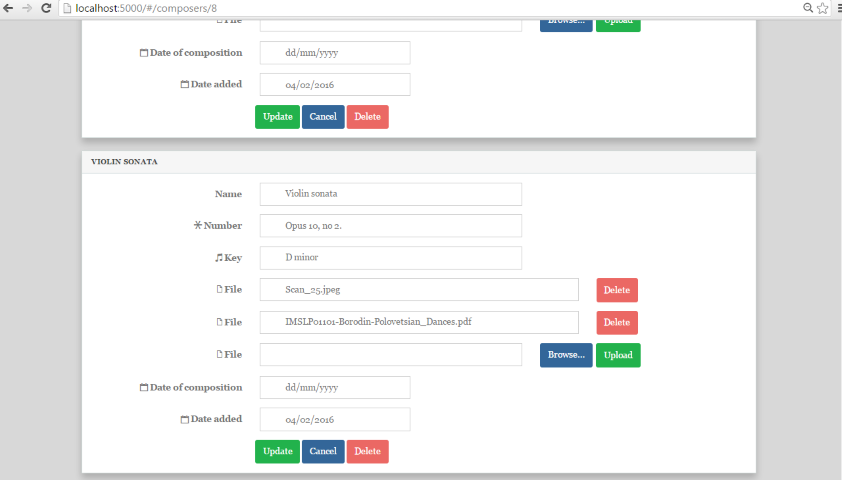

#The Catalog

(Project in fulfillment of Udacity's Full-Stack Web Developer Nanodegree)

##What is it?

This web app can be used to store and catalog sheet music files that may have unique annotations, editing or fingering. 
The user can scan each page of edited music, or annotate a pdf file, and upload all files to the server through the web interface. 
The user creates a sheet music item to associated the uploaded files with.
Each sheet music item may have associated data such as an identifying number (opus or another cataloging system number)
and key (such as C major). Sheet music items are cataloged to a composer. All composer, music items, and music
files are unique to a individual signed-on user.

##Technical information

The front end of this web app was built using the angular.js framework with bootstrap css components.
Data is updated and retrieved via a python Flask web server through calls to a REST api.
The front end portion of the authentication service utilizes angular library Satellizer.

###Authentication and authorization
Authentication is provided either via Oauth (google, facebook, twitter), or through a user supplied email/password
combination. Note that the web app should be run under https in order to securely save passwords.
Passwords are stored in the database via a one way hashing function for security.

Once logged in, JSON web tokens are used to authenticate users rather than cookies. Therefore we do not need to 
store a randomly generated string in the session to mitigate CSRF attacks.
(See here for more information http://stackoverflow.com/questions/21357182/csrf-token-necessary-when-using-stateless-sessionless-authentication)
This web token will expire after one hour. The web tokens are passed as a bearer in the HTTP authorization header. 
It is not possible to access the REST api JSON endpoints via the browser once logged in, as the web token is required
in the HTTP header.

###Extra credit

- Project uses javascript MVC framework angular.js instead of jinja templating
- API performs CRUD operations on the database and allows uploading and saving of files to the server
- Instead of nonce tokens to mitigate cross site request forgeries, JSON web tokens are passed with every request
- Oauth login for google, facebook and twitter provided, as well as authentication via a user supplied email/password combination
- Passwords stored in database using a one-way hashing function for security
- All categories and items added are only viewable to the user who added them
 
##How to run:

The required python modules can be loaded from the vagrant configuration file **pg_config.sh**
located in the top directory of this repository.

This module has a PostgreSQL backend. The database can be created from psql using the script provided:

	sudo su postgres
	psql 
	\i catalog_create_database.sql
	
The database can be seeded with the following command:

	python catalog_seed_database.py
	
This script generates some test data to play around with. Two users are created with the
email/password combinations katja@gmail.com/cat and louisa@gmail.com/dog
	
The web server can be started with the following command:

	python run.py
	
The client can be accessed through http://localhost:5000/

##Using the app

First log into the app using via the log in screen 

Successful login will show a success message 

If it is the first time logging into the application, you will need to create some 
composers and music items. 

Once you have added some composers, you can use the hyperlink in the composers name
to navigate to a list of music items.

Add a music item and file to associate with the composer.

Multiple files can be added and uploaded with a music item. Music items and files can be updated or deleted.

##Browers:

This web app has been tested on Firefox 43.0.4 on Chrome 48.0.2564.97 m. 
HTML5 date input boxes have been used, because the date picker is not supported in Firefox, 
a placeholder text 'yyyy-mm-dd' has been added to instruct the user how to enter a valid date.

##Release plans:

###TODO:
- Search facilities
- Ability to re-download the uploaded files associated with a music item
- Replace HTML5 date input with a javascript date component that works on all browsers
- Facilitate running web app over SSL

